#**Traffic Sign Recognition** 

**Build a Traffic Sign Recognition Project**

The goals / steps of this project are the following:
* Load the data set (see below for links to the project data set)
* Explore, summarize and visualize the data set
* Design, train and test a model architecture
* Use the model to make predictions on new images
* Analyze the softmax probabilities of the new images
* Summarize the results with a written report

[//]: # (Image References)

[image1]: ./examples/visualization.jpg "Visualization"
[image2]: ./examples/grayscale.jpg "Grayscaling"
[image3]: ./examples/random_noise.jpg "Random Noise"
[image4]: ./examples/placeholder.png "Traffic Sign 1"
[image5]: ./examples/placeholder.png "Traffic Sign 2"
[image6]: ./examples/placeholder.png "Traffic Sign 3"
[image7]: ./examples/placeholder.png "Traffic Sign 4"
[image8]: ./examples/placeholder.png "Traffic Sign 5"

## Rubric Points
###Here I will consider the [rubric points](https://review.udacity.com/#!/rubrics/481/view) individually and describe how I addressed each point in my implementation.  

---
###Step 0 - Writeup

####1. Provide a Writeup / README that includes all the rubric points and how you addressed each one. You can submit your writeup as markdown or pdf. You can use this template as a guide for writing the report. The submission includes the project code.

Here is a link to my [project code](https://github.com/balintfodor/CarND-Traffic-Sign-Classifier-Project/blob/master/Traffic_Sign_Classifier.ipynb)

###Step 1 - Data Set Summary & Exploration

####1. Provide a basic summary of the data set. In the code, the analysis should be done using python, numpy and/or pandas methods rather than hardcoding results manually.

I used numpy for the task:

* Number of training examples = 34799
* Number of validation examples = 4410
* Number of testing examples = 12630
* Image data shape = (32, 32, 3)
* Number of classes = 43

####2. Include an exploratory visualization of the dataset.

I plotted the histogram of the individual classes in the training set. We can clearly see that the different classes are not represented equally. This can cause problem since the network can easily reach a better-than-random guessing just by predicting the most populated classes instead of analysing the image content. I will handle this problem in the data augmentation phase (Step 2).

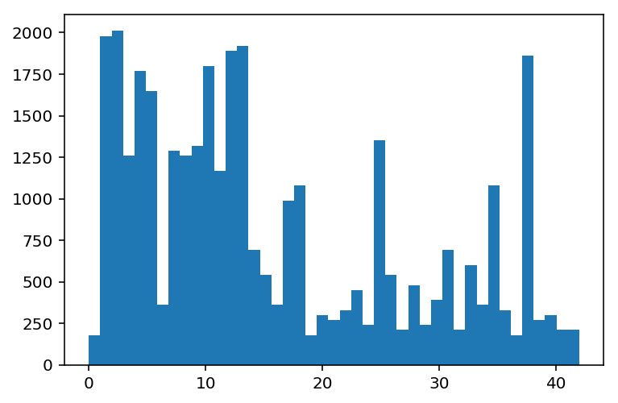

###Step 2 - Design and Test a Model Architecture

####1. Describe how you preprocessed the image data. What techniques were chosen and why did you choose these techniques? Consider including images showing the output of each preprocessing technique. Pre-processing refers to techniques such as converting to grayscale, normalization, etc. (OPTIONAL: As described in the "Stand Out Suggestions" part of the rubric, if you generated additional data for training, describe why you decided to generate additional data, how you generated the data, and provide example images of the additional data. Then describe the characteristics of the augmented training set like number of images in the set, number of images for each class, etc.)

The only prerprocessing I applied to the images is a grayscaling and a value transformation to the range [-1, 1]. I used skimage.color.rgb2gray which already squashes the values to the range [0, 1]. My assumption is that the shape and the picture of a traffic sign is more important than its color, and a traffic sign can be identified without the color.

I choose to perform data augmentation to represent every class in the training set equally. The data generator function first counts the population of the most populated class, then for every class it generates a number of images to match the population of the given class to the population of the most populated one. The image generation consists of picking a random image from the class, then applying a random rotation (in the range [-30, 30] degrees), a random scale (with the factor in range [0.8, 1.2]) and a random value noise (in the range [0, 0.01]). The mode is selected to 'symmetric' (instead of 'constant') for all the spatial transformations so the generated images would not stand out with their blank borders and clipped area.

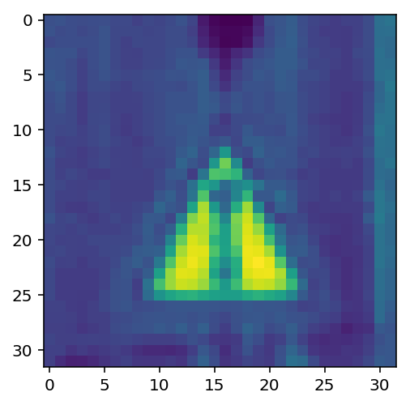
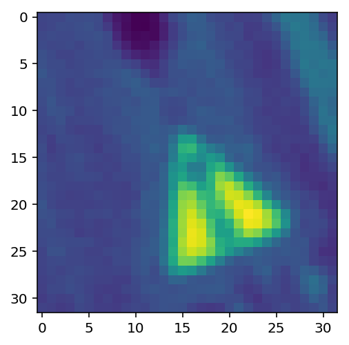

I analised the class histogram again, but now for the augmented data. Now it looks like the classes are represented similarly.

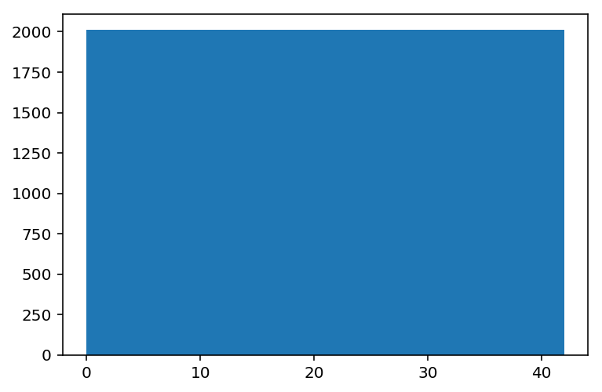

####2. Describe what your final model architecture looks like including model type, layers, layer sizes, connectivity, etc.) Consider including a diagram and/or table describing the final model.

My final model is basically a modified LeNet.

| Layer | Description | 
|:---:|:---:| 
| input | 32x32x1 grayscale image | 
| conv 5x5, 12 | 1x1 stride, valid padding, outputs 28x28x12 |
| relu | |
| max pool | 2x2 stride, valid padding, outputs 14x14x12 |
| conv 5x5, 32 | 1x1 stride, valid padding, outputs 10x10x32 |
| relu | |
| max pool | 2x2 stride, valid padding, outputs 5x5x32 |
| flatten | outputs 800x1 |
| fc, 120 | outputs 120x1 |
| relu | |
| fc, 84 | outputs 84x1 |
| relu | |
| fc, 43 | outputs 43x1, logits corresponding to the classes |

Important to note that the sigma for the truncated normal distribution for the inital weights is set to 0.001.

####3. Describe how you trained your model. The discussion can include the type of optimizer, the batch size, number of epochs and any hyperparameters such as learning rate.

I used softmax cross entropy as the loss for the optimization. I chose Adam optimizer with learning rate of 0.002. The batch size is 1024 and the maximum number of epochs is 1000. The training finishes if the last five accuracy measurement on the whole validation data is above 0.93. The procedure measures validation accuracy after every 512 batch. With these settings the training finished at epoch 377.

####4. Describe the approach taken for finding a solution and getting the validation set accuracy to be at least 0.93. Include in the discussion the results on the training, validation and test sets and where in the code these were calculated. Your approach may have been an iterative process, in which case, outline the steps you took to get to the final solution and why you chose those steps. Perhaps your solution involved an already well known implementation or architecture. In this case, discuss why you think the architecture is suitable for the current problem.

To reach the final solution I tuned the model, the training parameters and the preprocessing phase.

First I tried with an unmodified LeNet (sigma param is at 0.1), the batch size was small (32-64-128) and grayscale [-1,1] images. First I used gradient descent with a small learning rate to check that the model works: the loss is decreasing. Then switched to Adam and played with the learning rate. These setups were not satisfying, from a certain number of epochs the validation accuracy started to stagnate or even decrease.

Then I modified the preprocessing to do an rgb2hsv conversion. I hoped that the dominant tones of the traffic signs can help the model train. I tripled the number of feature maps in the model, and also played with larger layer numbers in the fully connected layers. It was not satisfying and I had the feeling that the model was much larger than it should be and it can be the explanation for the slow learning.

So I went back for grayscale preprocessing. Noticed that the sigma parameter in the weight initialization is really significant. Played with the learning rate and the batch size. Reached approx. 0.8-0.85 accuracy. Enlarging only the fully connected layers by a factor of 2 and 3 did not helped, but enlarging only the number of feature maps by a factor of 2 helped. I went back to tune the learning rate properly so the training go a bit faster.

My final result for the traning loss is below 0.0001, the training accuracy is above 0.9999, the validation loss is 1.2023 and the validation accuracy is 0.9358. Note that the validation accuracy was above 0.93 for 5 validation accuracy measurement (which is 5*512 batch training steps). The maximum validation accuracy was 0.9501. The accuracy on the test set was 0.9121.

###Test a Model on New Images

####1. Choose five German traffic signs found on the web and provide them in the report. For each image, discuss what quality or qualities might be difficult to classify.

I chose 6 images, rescaled and cropped to fit the shape 32x32x3:

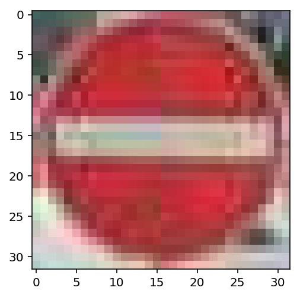 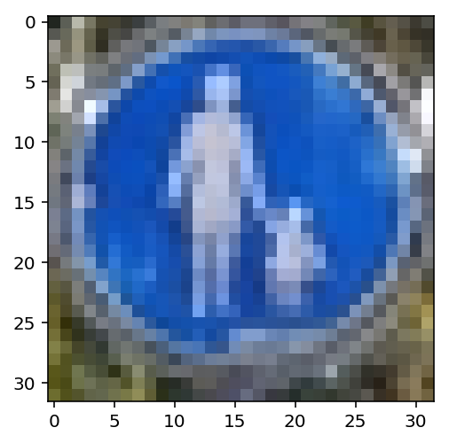 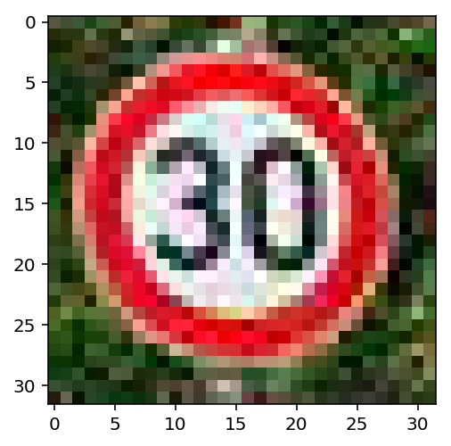 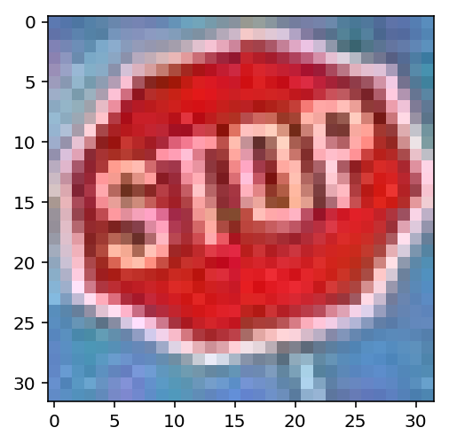 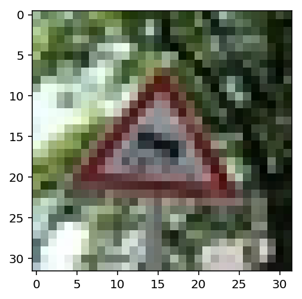 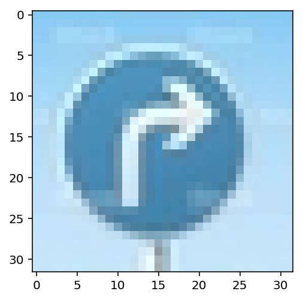

I expected that image 5 is hard to classify because of the fuzzy background and the blurry pictogram.

####2. Discuss the model's predictions on these new traffic signs and compare the results to predicting on the test set. At a minimum, discuss what the predictions were, the accuracy on these new predictions, and compare the accuracy to the accuracy on the test set (OPTIONAL: Discuss the results in more detail as described in the "Stand Out Suggestions" part of the rubric).

I used the model to predict the images and picked a random image from the training set with a class matching the prediction, instead of using the signnames.csv file to identify the signs. It is more intuitive for me.

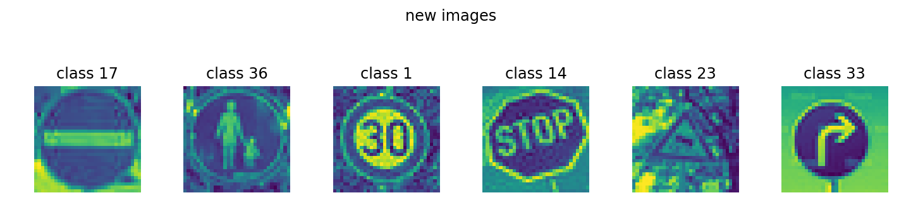
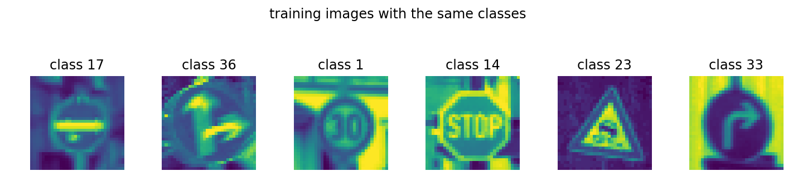

Only the second image is mispredicted, so the accuracy from this measurement is 5/6=0.83. The accuracy on the test set is 0.9121. The two numbers can not be compared validly because of the huge difference of the sample quantities.

####3. Describe how certain the model is when predicting on each of the five new images by looking at the softmax probabilities for each prediction. Provide the top 5 softmax probabilities for each image along with the sign type of each probability. (OPTIONAL: as described in the "Stand Out Suggestions" part of the rubric, visualizations can also be provided such as bar charts)

The figure below shows the top 5 classes and the model confidence of them. The first column is the original (preprocessed) image to be predicted. The last 5 columns are the top 5 predictions. All the confidences is above 0.999. I expected a much lower confidence for the mispredicted one. I expected that the true class which is Pedestrians (class 27) is in the top 5 predictions, but it is not.

I plotted samples from all the classes (traning set) and found that Pedestrians sign (class 27) is in a triangle in the training set and not in a circle as I found on the web. So it is no surprise that the model could not guess the image well.

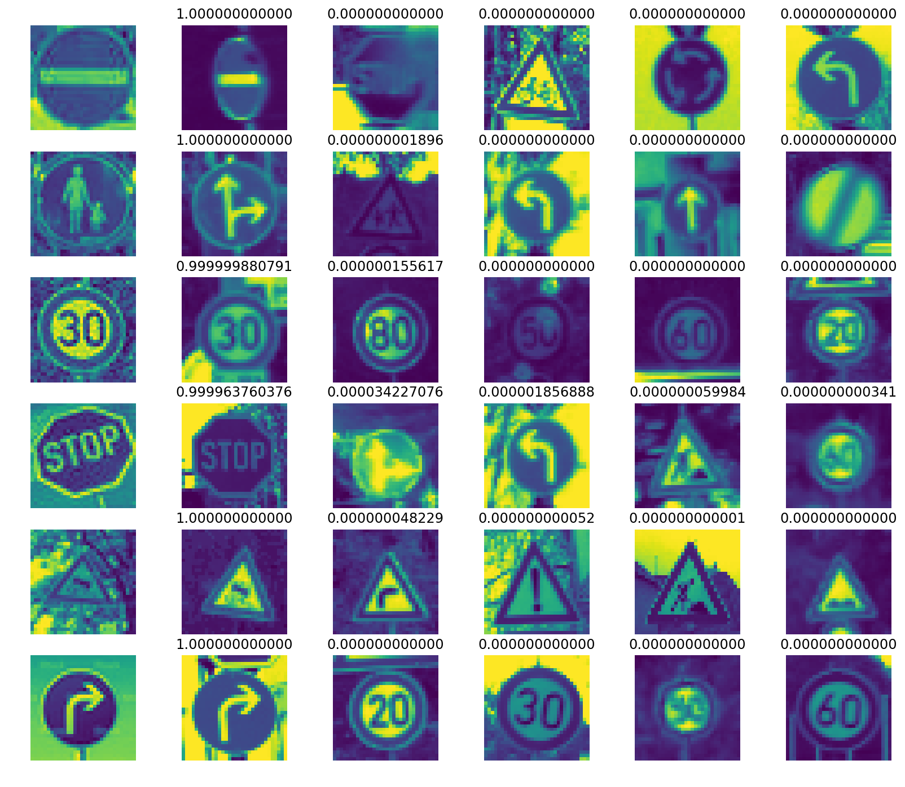

### (Optional) Visualizing the Neural Network (See Step 4 of the Ipython notebook for more details)
####1. Discuss the visual output of your trained network's feature maps. What characteristics did the neural network use to make classifications?

